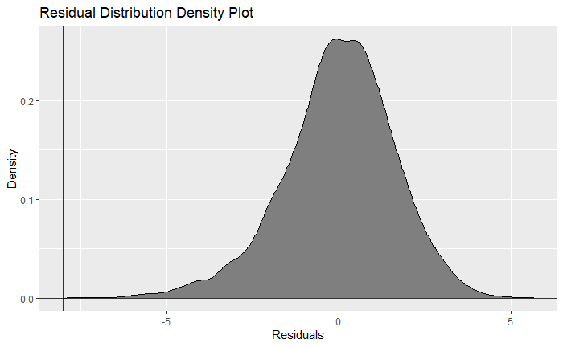
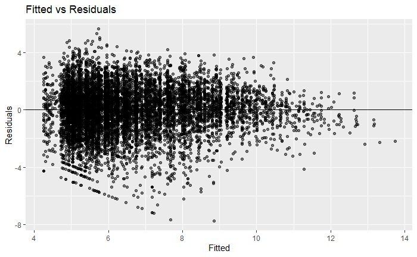
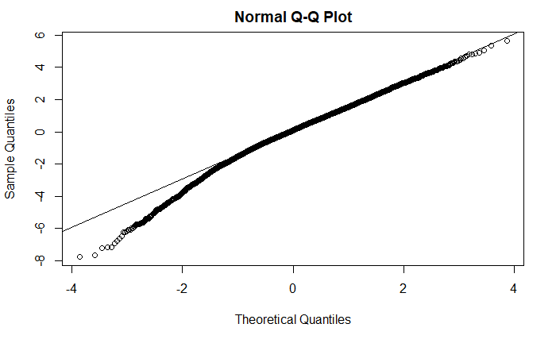

# K-12 Education Checkout Model

<br><br>
As a data analyst intern at OverDrive, I was given the opportunity to conduct a customer portfolio analysis of its K12 market. Undertaking this endeavor sparked a few underlying questions about the progress of individual customers. To answer these questions of progress, I started on a tangential project to model checkouts using characteristic data in the hopes to benchmark historical progress against where a DC should have been.

In pursuing this project, I was able to learn a lot about different types of models, particularly how to deal with hierarchical data and panel data. After exploring the benefits of a panel model using fixed effects, a gradient boosted tree algorithm, and various mixed effects models, I settled upon a linear mixed effects model which would allow me to use random effects that would affect the slope over the fixed effect of the time. After exploring various characteristic data, I was able to identify what characteristics made for significant differences in checkouts and built a function that allowed me to complete stepwise mixed effects regression, trying various combinations of random effects.

```
# Creating model selection function for things of importance for our models
# Here you need vector with the variables of random effects and function where the model has all data and things specified and just needs formulas to be fed

combine_all <- function(vector) {
    i <- length(vector)
    n <- 1
    for (n in 1:i) {
      a <- combn(vector, n, simplify = FALSE)
      if ( n == 1) {
      x <- unlist(lapply(a, paste0,collapse = ","))
      }
      else {
      x <- append(x, unlist(lapply(a, paste0,collapse = ",")))
      }
      n+1
    }
    x
}

model_sel <- function(vector, model, data, response, fixed ="+ YearsActive + 0"){
  i <- length(vector)
  n <- 1
    for (n in 1:i) {
      a <- combn(vector, n, simplify = FALSE)
      x <- lapply(a, paste0,collapse = "+")
      for (y in 1:(length(x))){
        b <- paste0(response, "~", x[[y]], fixed)
        if (y == 1 & n == 1){
          c <- c(b)
        }
        else{
          c <- append(c, b, after = length(c)) 
        }
        y-1
      }
    n+1
    }
  models <- lapply(c, model, data = data)
  AIC <- unlist(lapply(models, AIC))
  BIC <- unlist(lapply(models, BIC))
  Singular <- unlist(lapply(models, isSingular))
  data.frame(c, AIC, BIC, Singular) %>% arrange(AIC)
}

lmm_model <- function(formulas, data) {
  lmer(formula = formulas, data = data)
}
```

After performing such variable selection techniques, I was able to choose a model that satisfied a few conditions:

1. Had a low BIC/AIC
2. Was a simple enough model that could be explained to other business units

At the end of the day, the second condition was the biggest priority as the model would only be useful and implemented if the decisions that could be made from it were understandable.

I conducted a Box Cox transformation to normalize and was then able to take the next steps to contextualize the results. First, to see how good the model fit was, I looked at residual plots.

<br>







<br>

There is evidence of some heteroskedasticity in the errors, and thus, I will plan on using heteroskedasticity-robust errors to help with this. We can also see, that the residuals had a slight skew towards the left and thus we should be careful about such outliers.

Since we were concerned with how customers were performing with respect to how we believed they should have been performing, I decided to use the residuals (indirectly) to map where customers stood at a point in time. I used robust standard errors to calculate certain thresholds and depending on where the actual value for a year was a grouping was determined.

Because we used a log-linear model, I knew that at some point the growth rate of checkouts would decrease and thus decided after some EDA that the model would best work between a certain year range. Additionally, I put some limitations on the type of customers that could be modeled, as some customers were outliers and thus not best predicted by the model.


